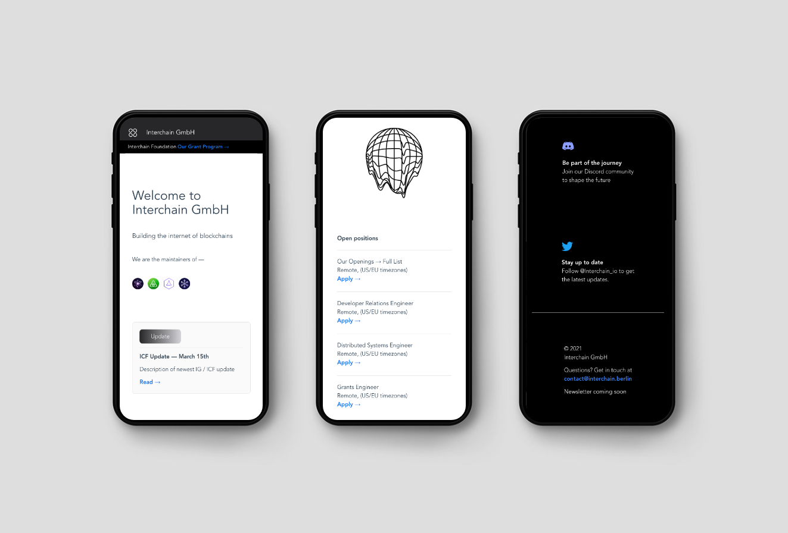

<div align="center">
  
  
  <hr />
  
  <br/>
  <p> v.2 </p>
  <h3> Interchain GmbH Website </h3>
  
  <br/>
    <a href="https://naughty-roentgen-335a9c.netlify.app/"> Visit Website </a>
  <br/>
</div>

---

<div align="center">
  <br/>
  
</div>

<br/>

## Project setup

---

```
yarn install
```

### Compiles and hot-reloads for development

```
yarn serve
```

### Compiles and minifies for production

```
yarn build
```

### Lints and fixes files

```
yarn lint
```

### Customize configuration

See [Configuration Reference](https://cli.vuejs.org/config/).
